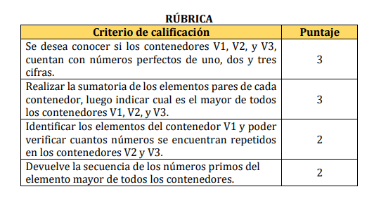
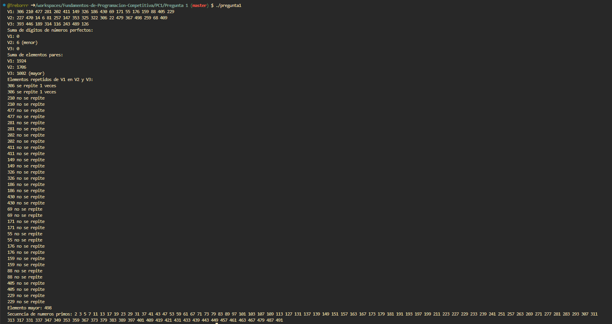

# Pregunta 1: Contenedores (10 puntos) – Uso de Vectores, Set o Multiset
Crear cuatro contenedores de números enteros V1, V2, V3 y V4.
### Aporte:
Se requiere la implementación de tres estructuras de datos, denominadas V1, V2, y V3, que
almacenen números enteros. Cada estructura deberá inicializarse con una cantidad de
elementos aleatoria, comprendida entre 5 y 20. Es imperativo que todos los números
contenidos sean positivos y no superen el valor de 500.
### Producción:
1. Se desea conocer si los contenedores V1, V2, y V3, cuentan con números perfectos de
uno, dos y tres cifras, mostrar la suma de los dígitos de estos números perfectos por
cada contenedor, y quien es el menor de ellos .
NOTA: Un número perfecto es un entero positivo que es igual a la suma de sus
divisores propios positivos, excluyendo el mismo número. Por ejemplo, el 6 es un
número perfecto porque 1 + 2 + 3 = 6.
Por ejemplo:
V1=[181,6,5,7,28,4,7]
V2=[55,4,3,7,28,5]
V3=[11,54,33,6,496,9,11]
Resultado:
V1: 6 + 2 + 8 = 16
V2: 2 + 8 = 10 (menor)
V3: 4 + 9 + 6 = 19
2. Realizar la sumatoria de los elementos pares de cada contenedor, luego indicar cual
es el mayor de todos los contenedores V1, V2, y V3.
Por ejemplo:
V1=[181,6,5,7,28,4,7]
V2=[55,4,3,7,28,5]
V3=[11,54,33,6,7,9,11]
Resultado:
V1: 6 + 28 + 4 = 38
V2: 4 + 28 = 32
V3: 54 + 6 = 60 (mayor)
3. Identificar los elementos del contenedor V1 y poder verificar cuantos números se
encuentran repetidos en los contenedores V2 y V3.
Por ejemplo:
V1=[23, 21, 29,5, 6]
V2=[23, 21, 29,5, 7]
V3=[3,5,23,29,21, 5]
Resultado:
23 se repite 2 veces
21 se repite 1 vez
29 se repite 2 veces
5 se repite 3 veces
6 no se repite
4. Devuelve la secuencia de los números primos del elemento mayor de todos los
contenedores.
Por ejemplo:
V1=[23, 21, 25, 5, 6]
V2=[23, 21, 2,5, 7]
V3=[3,5,23,7,21, 5]
Resultado:
Elemento mayor: 25
Secuencia de números primos: 2, 3, 5, 7, 11, 13, 17, 19, 23

# Rubrica:

# Terminal Output:
