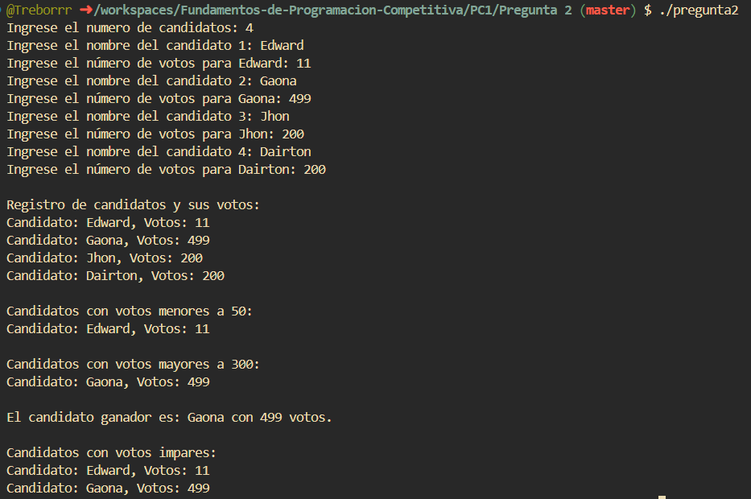

# PREGUNTA 2: Votación para representante de trabajadores (10 puntos)
En una empresa de Colombia, se realizó una votación para designar al
representante de los trabajadores, esta votación es realizada por todos los
trabajadores nombrados y contratados, donde participaron “C” candidatos.
Se realizó un registro manual, pero la directiva del comité de trabajadores
pretende desarrollar una aplicación que permita registrar los resultados de
las votaciones. Se debe tener en cuenta que con estos resultados se podrá
obtener varios reportes.
### Aporte:
La entrada contiene un número de candidatos, que sería la variable C, donde
registrar nro de candidatos a ingresar. La variable C es un número entero (0
≤ C ≤ 10). 
El nombre del candidato es una cadena de caracteres y el número de votos
corresponde a enteros.
La entrada consta de varios casos de prueba. La primera línea de cada caso de
prueba contiene el nombre del candidato y la segunda el número de votos que
es un número entero N (0 ≤ N ≤ 500). 
### Producción:
1. Mostrar el registro de los candidatos con sus votos respectivos.
2. Imprime cual los candidatos con votos menores a 50 y los candidatos
con votos mayores a 300.
3. Mostrar que candidato ganador, el que tiene el mayor de los votos.
4. Mostrar los candidatos que obtuvieron resultados impares
## Rubrica: 

## Terminal Output:
