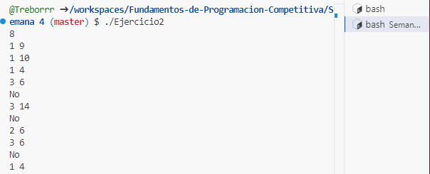

# Ejercicio 1:

### Input Format
The first line of the input contains an integer **N**.  
The next line contains **N** space-separated integers (1-based index).  
The third line contains a single integer **x**, denoting the position of an element that should be removed from the vector.  
The fourth line contains two integers **a** and **b** denoting the range that should be erased from the vector inclusive of **a** and exclusive of **b**.

### Constraints
- \(1 \leq N \leq 10^5\)
- \(1 \leq x \leq N\)
- \(1 \leq a < b \leq N\)

### Output Format
Print the size of the vector in the first line and the elements of the vector after the two erase operations in the second line separated by space.

### Sample Input
```
6
1 4 6 2 8 9
2
2 4
```

### Sample Output
```
3
1 8 9
```

### Explanation
The first query is to erase the 2nd element in the vector, which is 4. Then, the modified vector is (1 6 2 8 9).  
We want to remove the range of 2-4, which means the 2nd and 3rd elements should be removed. Then 6 and 2 in the modified vector are removed and we finally get {1 8 9}.

---

# Ejercicio 2

Sets are a part of the C++ STL. Sets are containers that store unique elements following a specific order. Here are some of the frequently used member functions of sets:

### Declaration:
```cpp
set<int> s; // Creates a set of integers.
```

### Size:
```cpp
int length = s.size(); // Gives the size of the set.
```

### Insert:
```cpp
s.insert(x); // Inserts an integer x into the set s.
```

### Erasing an element:
```cpp
s.erase(val); // Erases an integer val from the set s.
```

### Finding an element:
```cpp
set<int>::iterator itr = s.find(val); // Gives the iterator to the element val if it is found.
Ex: set<int>::iterator itr = s.find(100); // If 100 is not present, then itr == s.end().
```

To know more about sets [click here](#). Coming to the problem, you will be given **Q** queries. Each query is of one of the following three types:

1. Add an element **x** to the set.
2. Delete an element **x** from the set. (If the number **x** is not present in the set, then do nothing).
3. If the number **x** is present in the set, then print "Yes" (without quotes), else print "No" (without quotes).

---

## Input Format
The first line of the input contains **Q** where **Q** is the number of queries. The next **Q** lines contain 1 query each.  
Each query consists of two integers **y** and **x** where **y** is the type of the query and **x** is an integer.

### Constraints:
- \(1 \leq Q \leq 10^5\)
- \(1 \leq y \leq 3\)
- \(1 \leq x \leq 10^9\)

## Output Format
For queries of type **3**, print "Yes" (without quotes) if the number **x** is present in the set, and if the number is not present, then print "No" (without quotes).  
Each query of type **3** should be printed in a new line.

---

## Sample Input
```
8
1 9
1 6
1 10
1 4
3 6
3 14
2 6
3 6
```

## Sample Output
```
Yes
No
No
```

## Console Output: 

 